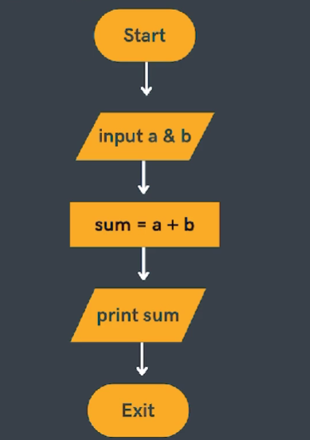
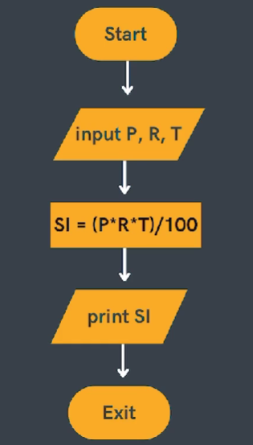
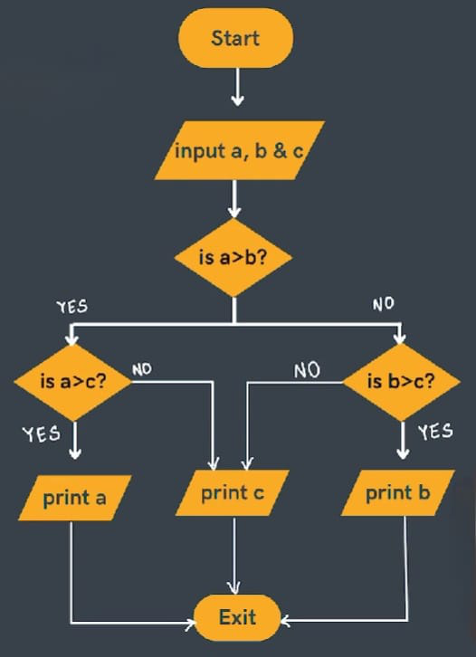
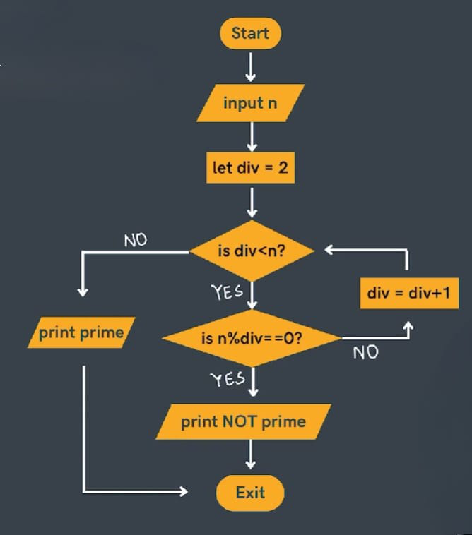
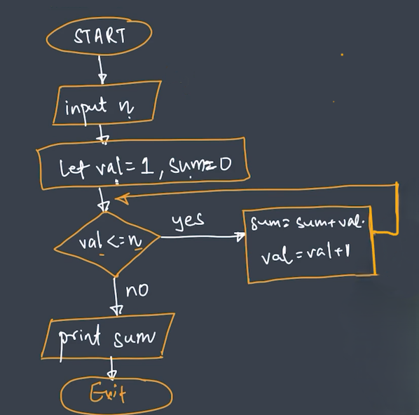
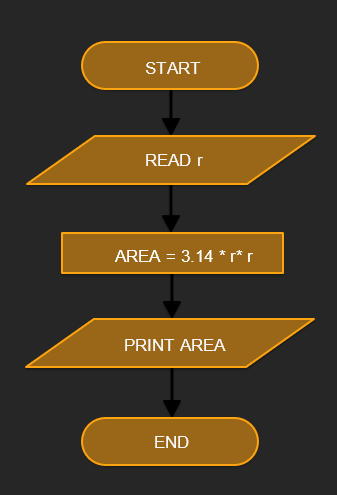
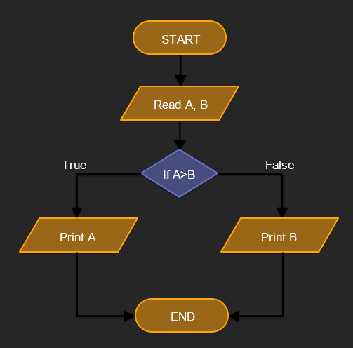
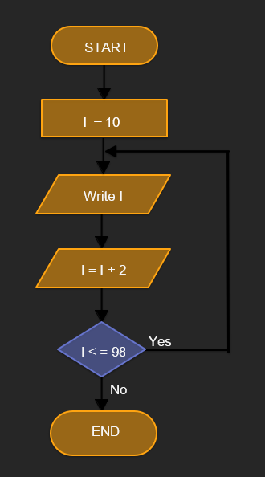
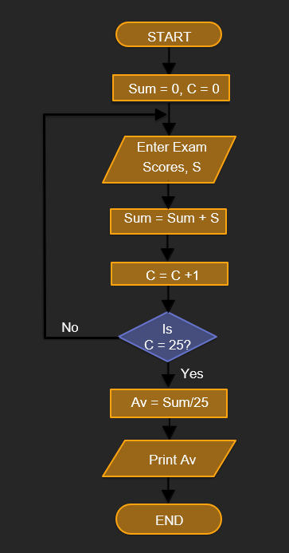

# Flowcharts & Pseudocode

- **Flowcharts** - Diagrams to represent solutions of plroblems
- **Pseudocode** - Pseudocode is a detailed yet readable description of what a computer program or algorithm should do.

## Components


## 1. Sum of Two Numbers

**Pseudocode**
1. Start
2. Input numbers, a & b
3. Calculate sum = a + b
4. Print sum
5. Exit

**Flowchart**<br>


## 2. Calculate Simple Interest

**Pseudocode**
1. Start
2. Input principal (p), rate (r) & time (t)
3. Calculate SI = (p * r * t) / 100
4. Print SI
5. Exit

**Flowchart**<br>


## 3. Find Maximum of 3 Numbers

**Pseudocode**
1. Start
2. Input a, b & c
3. <br>

    ```
    If a > b then
      If a > c then
        Print a
      Else
        Print c
    Else
      If b > c then
        Print b
      Else
        Print c
    ```
4. Exit

**Flowchart**<br>


## 4. Find If a Number is Prime or Not

**Pseudocode**
1. Start
2. Input n
3. Let div = 2
4. <br> 
  
    ```
    While div < n do
      If n % div == 0 then
        Print "not prime"
        Exit
      Else
        div = div + 1
    ```
5. Print "prime"
6. Exit

**Flowchart**<br>


## 5. Sum of First N Natural Numbers

**Pseudocode**
1. Start
2. Input n
3. Let val = 1 & sum = 0
4. <br>

   ```
   While val <= n do
     sum = sum + val
     val = val + 1
   ```
5. Print sum
6. Exit

**Flowchart**<br>


## 6. Flowchart to calculate the area of a circle

**Pseudocode**
1. Start
2. Input radius r
3. Calculate area = 3.14 * r * r
4. Print area
5. Exit

**Flowchart**<br>


## 7. Flowchart to find the greatest from 2 numbers.

**Pseudocode**
1. Start
2. Input A, B
3. <br>

   ```
   If A > B then
     Print A
   Else
     Print B
   ```
4. Exit

**Flowchart**<br>


## 8. Flowchart to print the Even numbers between 9 and 100.

**Pseudocode**
1. Start
2. Set I = 10
3. Print I
4. Set I = I + 2
5. <br>
   
   ```
   If I <= 98 then
     Go to step 3
   Else
     End
   ```
6. Exit

**Flowchart**<br>


## 9. Flowchart for calculating the average from 25 exam scores.

**Pseudocode**
1. Start
2. Set Sum = 0, C = 0
3. Enter Exam Score, S
4. Set Sum = Sum + S
5. Set C = C + 1
6. <br>

    ```
    If C = 25 then
      Set Av = Sum / 25
    Print Av
      Go to Step 7
    Else
      Go to Step 3
    ```
7. Exit

**Flowchart**<br>

