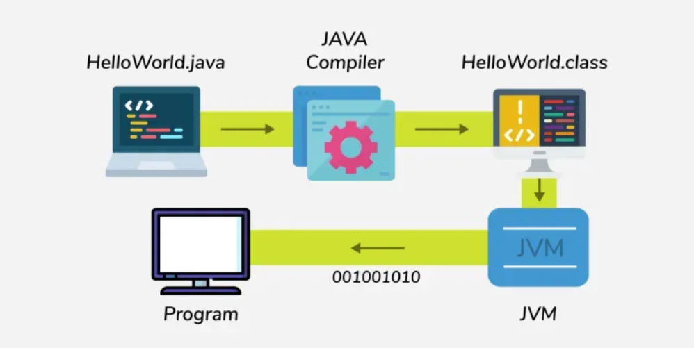

# Introduction to Java

Java is a high-level, object-oriented programming language developed by Sun Microsystems in 1995. It is mostly used for building desktop applications, web applications, Android apps and enterprise systems.

## Key Features

- **Platform Independent**: Code compiles into bytecode that runs on any JVM. "Write Once, Run Anywhere."
- **Object-Oriented Programming (OOP)**: Java supports OOP concepts to create modular and reusable code.
- **Statically Typed**: Variables must be declared with a type. Compiler catches errors early.
- **Robust and secure**: Java ensures reliability and security through strong memory management and exception handling.
- **Multithreading and Concurrency**: Java allows concurrent execution of multiple tasks for efficiency.

## Hello World Program in Java

```java
public class HelloWorld {  // Declares a public class named HelloWorld. File must be HelloWorld.java
    public static void main(String[] args) {  // Main method - entry point of the program
        System.out.println("Hello World!");  // Prints "Hello World!" to the console
    }  // End of main method
}  // End of class
```

### Output

```
Hello World!
```

### How does Java code run?

- Write code in a file like HelloWorld.java.
- Java Compiler "javac" compiles it into bytecode "HelloWorld.class".
- JVM (Java Virtual Machine) reads the .class file and interprets the bytecode.
- JVM converts bytecode to machine readable code i.e. "binary" (001001010) and then execute the program.


