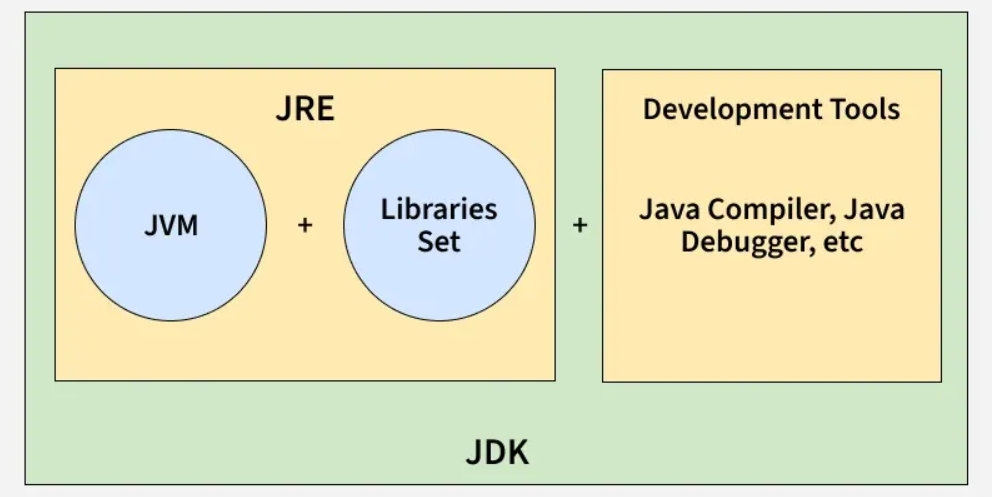

# Differences Between JDK, JRE and JVM

JDK (Java Development Kit) provides tools and libraries to develop Java applications, working with JRE and JVM. JRE (Java Runtime Environment) offers the libraries and JVM needed to run Java programs. JVM (Java Virtual Machine) executes the compiled Java bytecode on the system.

> **Note:** Java bytecode can run on any machine with a JVM, but JVM implementations are platform-dependent for each operating system.

## JDK (Java Development Kit)

JDK is a software development kit used to build Java applications. It contains the JRE and a set of development tools.

- Includes compiler (javac), debugger, and utilities like jar and javadoc.
- Provides the JRE, so it also allows running Java programs.
- Required by developers to write, compile, and debug code.

### Components of JDK:

- JRE (JVM + libraries)
- Development tools (compiler, jar, javadoc, debugger)

### Note:

- JDK is only for development (it is not needed for running Java programs)
- JDK is platform-dependent (different version for Windows, Linux, macOS)

### Working of JDK:

- Source Code (.java): Developer writes a Java program.
- Compilation: The JDK’s compiler (javac) converts the code into bytecode stored in .class files.
- Execution: The JVM executes the bytecode, translating it into native instructions.

## JRE (Java Runtime Environment)

JRE provides an environment to run Java programs but does not include development tools. It is intended for end-users who only need to execute applications.

- Contains the JVM and standard class libraries.
- Provides all runtime requirements for Java applications.
- Does not support compilation or debugging.

### Note:

- JRE is only for running applications, not for developing them.
- It is platform-dependent (different builds for different OS).

### Working of JRE:

- Class Loading: Loads compiled .class files into memory.
- Bytecode Verification: Ensures security and validity of bytecode.
- Execution: Uses the JVM (interpreter + JIT compiler) to execute instructions and make system calls.

## JVM (Java Virtual Machine)

JVM is the core execution engine of Java. It is responsible for converting bytecode into machine-specific instructions.

- Part of both JDK and JRE.
- Performs memory management and garbage collection.
- Provides portability by executing the same bytecode on different platforms.

### Note:

- JVM implementations are platform-dependent.
- Bytecode is platform-independent and can run on any JVM.
- Modern JVMs rely heavily on Just-In-Time (JIT) compilation for performance.

### Working of JVM:

1. **Loading**: Class loader loads bytecode into memory.
2. **Linking**: Performs verification, preparation, and resolution.
3. **Initialization**: Executes class constructors and static initializers.
4. **Execution**: Interprets or compiles bytecode into native code.

## JDK vs JRE vs JVM

| Component | Purpose | Includes | Platform Dependency |
|-----------|---------|----------|---------------------|
| **JDK** (Java Development Kit) | Used to develop Java applications | JRE + Development tools (javac, debugger, etc.) | Platform-dependent (OS specific) |
| **JRE** (Java Runtime Environment) | Used to run Java applications | JVM + Libraries (e.g., rt.jar) | Platform-dependent (OS specific) |
| **JVM** (Java Virtual Machine) | Executes Java bytecode | ClassLoader, JIT Compiler, Garbage Collector | JVM is OS-specific, but bytecode is platform-independent |

> **Key Point:** Java bytecode is platform-independent, but JVM is platform-dependent (different for Windows, Mac, Linux). This is what makes Java "write once, run anywhere."
